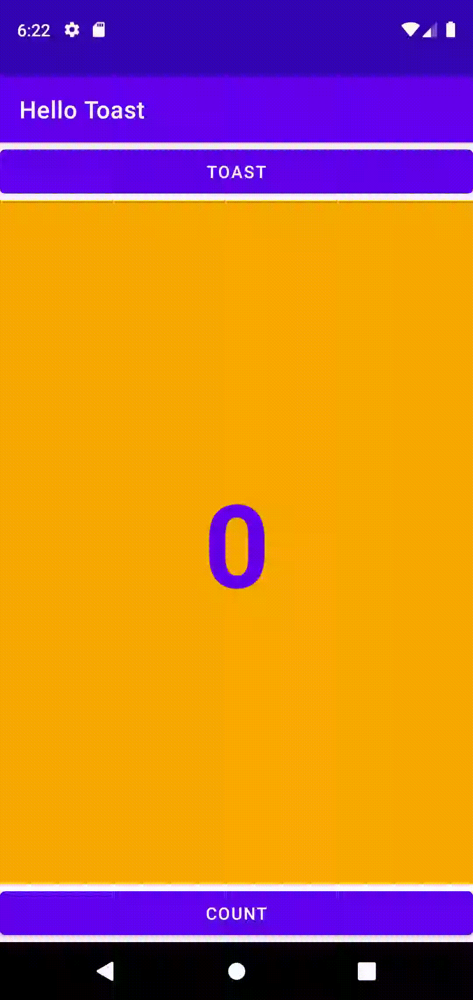

# Week 1 - Task

The task of the first week was to create a simple application with two buttons. The first "Toast" button would display a toast saying "Hello Toast".
The second "Count" button would increment the current count starting at 0 and update the screen.

