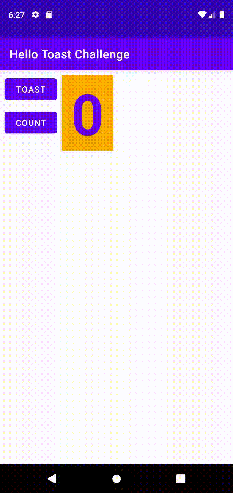
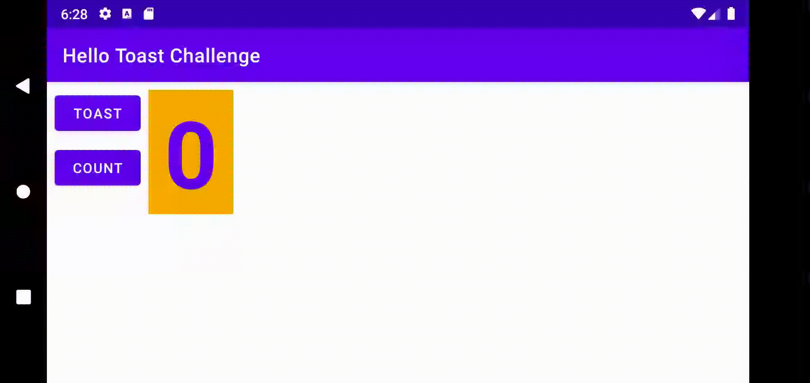

# Week 1 - Coding Challenge

The coding challenge for the first week was to make some edits to the Week - 1 task so that the application looked good in both horizontal and vertical orientation.
This was done by chaning the entire layout of the buttons and the textview.

## Portrait Orientation

## Landscape Orientation

